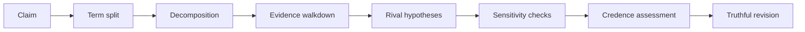

# Veracity

Veracity is a browser prototype for first-principles truth audits.

It is built for claims that deserve more than a quick yes/no answer. Veracity breaks a statement into testable pieces, exposes uncertainty, compares rival explanations, and shows the reasoning that would change the assessment.

The goal is not to decree truth. The goal is to make an answer inspectable.

## What It Does

- Parses loaded wording so a claim is not quietly swapped for an easier version.
- Decomposes broad statements into subclaims, premises, and atomic assumptions.
- Tracks credence as a range instead of forcing a binary answer.
- Compares rival explanations with similar effort.
- Flags weak links, coverage gaps, and load-bearing assumptions.
- Shows the optional math behind the plain-language assessment.



## Try It

This repo is a static browser app. The canonical entrypoint is `index.html`, but it must be opened through a local server because the prototype loads React, Babel, and JSX files in the browser.

```sh
python3 -m http.server 8766
```

Then open:

```text
http://localhost:8766/index.html
```

The bundled demo starts with a broad public claim, explains why the wording matters, rewrites the claim into a more defensible version, and lets curious readers expand the evidence and math underneath.

## Demo Analyses

The repository currently includes three public demo claims:

- "Increasing the minimum wage always increases unemployment."
- "AI will make most software engineers obsolete within five years."
- "People who sound confident are usually competent."

These are method demos, not final public reports. A source-complete publication should include dated primary-source URLs and reproducible source notes for every externally changing fact.

## Repository Map

- `index.html` - canonical static browser entrypoint.
- `First Principles Veracity.html` - compatibility redirect to `index.html`.
- `app.jsx` - main app shell and public intro.
- `data.js` - demo analyses and epistemic profiles.
- `verdict.jsx` - assessment labels, probability math, and plain-language rendering.
- `components.jsx` - shared UI components, inspector, tables, and checks.
- `diagram.jsx` - decomposition visualization.
- `styles.css` - full UI styling.
- `SKILL.md` - operator procedure for producing a Veracity-style audit.
- `agents/openai.yaml` - agent-facing skill metadata.
- `scripts/` - validation, math regression tests, and tone linting.

## Verification

Run the checks before trusting a change:

```sh
node scripts/validate-data.mjs
node --test scripts/test-math.mjs
node scripts/lint-tone.mjs
```

Expected validator baseline:

```text
Validated 3 analyses and 5 profiles.
```

Current validator warnings are allowed but should not be ignored: the `minwage` and `confidence` demos intentionally expose divergence between authored estimates and one multi-hypothesis softmax check. Treat those as audit flags, not test failures.

## Limits

Veracity is a prototype, not an oracle or production fact-checking service.

- It depends on CDN-hosted React, ReactDOM, Babel, and Google Fonts.
- It uses in-browser Babel, so it is not packaged for offline or archive-grade publication.
- The demo analyses are examples of the method, not source-complete public reports.
- No license file has been selected yet, so public reuse rights are not defined.
